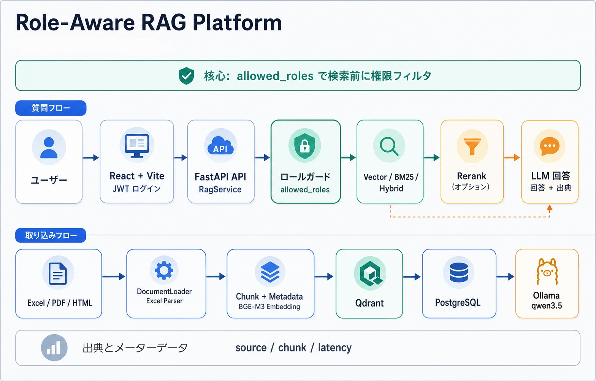
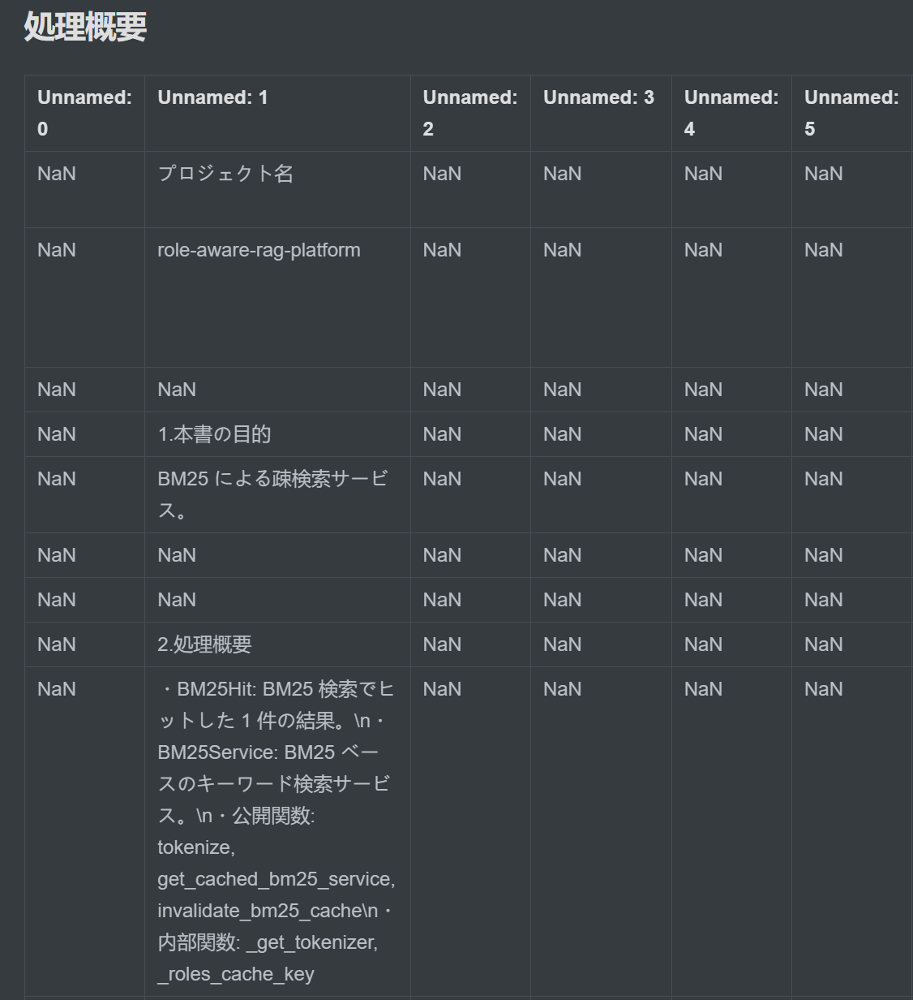
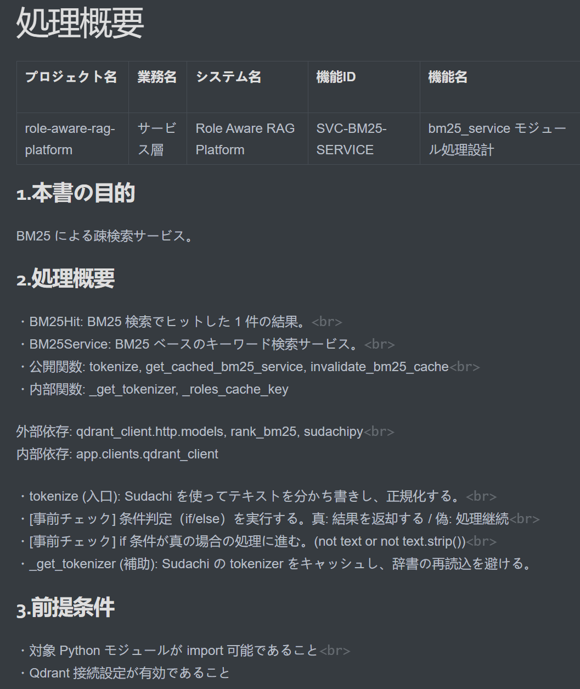
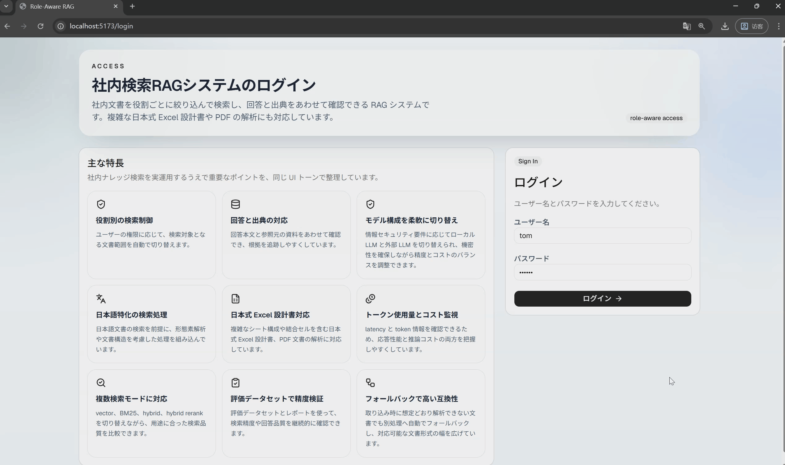
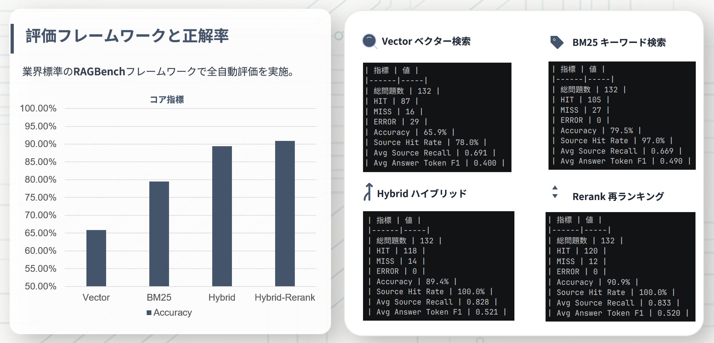

# Role Aware RAG Platform — role-aware RAG for enterprise knowledge bases

企業内ナレッジベース向けのロール認識 RAG プラットフォームです。検索入口で権限フィルタを行い、ユーザーが自分のロールで閲覧可能な文書だけを取得できるようにします。

---

<p align="left">
  <a href="./pyproject.toml"></a>
  <a href="./LICENSE"></a>
  <a href="https://github.com/preston-zhang-x/role-aware-rag-platform/actions/workflows/ci.yml"></a>
  
  
  
  
  <a href="https://github.com/preston-zhang-x/role-aware-rag-platform/stargazers"></a>
</p>

<p align="left">
  <a href="./README.md">中文</a> |
  <strong>日本語</strong> |
  <a href="./README.en.md">English</a>
</p>

---

## 概要

Role Aware RAG Platform は、企業内文書を対象にした RAG アプリケーションです。ユーザーロール、文書権限、ハイブリッド検索、回答ソースの追跡を 1 つの QA フローに統合し、社内ナレッジ検索、設計書 QA、権限制御が必要な業務システムに向いています。

特に、日本式の複雑な Excel 仕様書・設計書を構造化して解析することに重点を置いています。ベクトル検索、BM25、RRF 融合、rerank を組み合わせ、ローカル環境でも再現しやすい検索回答を提供します。



## 主な機能

- **ロール認識検索**：検索前に `allowed_roles` でフィルタし、`admin / manager / staff` をサポート
- **複数の検索モード**：`vector`、`bm25`、`hybrid`、`hybrid_rerank`
- **Excel 仕様書向け解析**：Sheet 意味、結合セル、KV 領域、表領域を保持
- **統一ドキュメントローダー**：`.xlsx`、`.xlsm`、`.xls`、`.xlsb`、`.pdf` に対応
- **追跡可能な回答**：回答本文、ヒットしたソース、chunk 位置、token、レイテンシを返却
- **フロントエンド分離**：バックエンドは `FastAPI`、フロントエンドは `React + Vite`
- **ローカル実行しやすい構成**：標準構成は `Ollama + BGE-M3 + local rerank-adapter`

## なぜ独自の Excel Parser が必要か

多くの日本式仕様書は、通常のデータ表ではなく、Excel をレイアウトツールとして使った設計文書です。単純にテキスト化すると、章、項目、説明領域、表領域の関係が失われやすくなります。

この parser は、人が仕様書を読むときに頼る構造情報を残すため、chunking、BM25 のマッチ、回答ソースの引用が安定します。

<table>
  <tr>
    <td width="50%" valign="top" align="center">
      <strong>MarkItDown の直接変換</strong>
    </td>
    <td width="50%" valign="top" align="center">
      <strong>独自 Excel Parser</strong>
    </td>
  </tr>
  <tr>
    <td width="50%" valign="top">
      
    </td>
    <td width="50%" valign="top">
      
    </td>
  </tr>
  <tr>
    <td width="50%" valign="top">
      <sub>複雑な Excel 仕様書では、<code>Unnamed</code> 列、<code>NaN</code>、説明領域と表領域の混在が起こりやすくなります。</sub>
    </td>
    <td width="50%" valign="top">
      <sub>項目名、章構造、行同士の関係、読みやすい順序を保持し、後続の検索品質を安定させます。</sub>
    </td>
  </tr>
</table>

## デモ



## 検索モード

`.env` の `RETRIEVAL_MODE` で切り替えます。

| モード | 説明 | 向いているケース |
| --- | --- | --- |
| `vector` | ベクトル検索のみ | 意味的な類似度を重視 |
| `bm25` | キーワード検索のみ | ID、項目名、完全一致語を重視 |
| `hybrid` | ベクトル + BM25 を RRF で融合 | バランス重視 |
| `hybrid_rerank` | `hybrid` の後に rerank | より高い精度を狙う場合 |

## 評価結果

RAGBench `emanual` サブセットでオフライン評価を行いました。標準の `hybrid_rerank` モードで `132` 問を評価しています。

| 指標 | 結果 |
| --- | --- |
| Accuracy | `90.9%` |
| Source Hit Rate | `100.0%` |
| Avg Source Recall | `0.833` |
| Avg Answer Token F1 | `0.520` |

詳細は [`docs/report_ragbench_emanual_hybrid_rerank.md`](docs/report_ragbench_emanual_hybrid_rerank.md) を参照してください。



## 技術スタック

| レイヤー | コンポーネント |
| --- | --- |
| Backend | `FastAPI`、`SQLAlchemy`、`Alembic` |
| Retrieval | `Qdrant`、`BM25`、`RRF`、local `reranker` |
| AI | `OpenAI-compatible API`、標準は `Ollama`、`BGE-M3`、`qwen3.5:4b` |
| Parsing | `openpyxl`、`pdfplumber`、`markitdown` |
| Frontend | `React 19`、`Vite`、`TanStack Query`、`React Router`、`Tailwind CSS` |
| Infra | `PostgreSQL`、`Docker Compose` |

## クイックスタート

### 1. 必要な環境

- Python `3.11`
- `uv`
- Docker / Docker Compose
- Ollama
- Node.js と `npm`

### 2. 環境変数を準備

```powershell
Copy-Item .env.example .env
```

標準構成は `Ollama + BGE-M3 + hybrid_rerank` です。rerank を使わない場合は、`.env` の `RETRIEVAL_MODE` を `hybrid`、`bm25`、または `vector` に変更してください。

### 3. 依存関係をインストール

```powershell
uv sync --extra rerank
npm --prefix frontend install
```

### 4. 基盤サービスを起動

```powershell
docker compose up -d db qdrant
uv run alembic upgrade head
```

### 5. ローカルモデルを準備

Ollama が起動していない場合は、別ターミナルで起動します。

```powershell
$env:OLLAMA_MAX_LOADED_MODELS="1"
$env:OLLAMA_NUM_PARALLEL="1"
ollama serve
```

標準モデルを取得します。

```powershell
ollama pull qwen3.5:4b
ollama pull bge-m3
```

### 6. rerank-adapter を起動

`RETRIEVAL_MODE=hybrid_rerank` の場合だけ必要です。別ターミナルで実行してください。

```powershell
uv run python script/run_rerank_adapter.py
```

### 7. ベクトル DB を再作成して文書を投入

```powershell
uv run python script/reset_qdrant_collection.py --collection documents
uv run python script/ingest_repo_spec.py --dir docs --pattern *.xlsx --recursive
```

単一ファイルを投入する場合：

```powershell
uv run python script/ingest_repo_spec.py --file "docs\設計_処理設計書_excel_parser.xlsx"
```

### 8. 初期ログインユーザーを作成

bcrypt ハッシュを生成します。

```powershell
uv run python -c "from app.core.security import hash_password; print(hash_password('123456'))"
```

出力されたハッシュを DB に登録します。

```sql
INSERT INTO users (username, hashed_password, role)
VALUES
  ('admin_demo', '<PUT_HASH_HERE>', 'admin'),
  ('manager_demo', '<PUT_HASH_HERE>', 'manager'),
  ('staff_demo', '<PUT_HASH_HERE>', 'staff');
```

### 9. アプリケーションを起動

バックエンド：

```powershell
uv run uvicorn app.main:app --reload
```

フロントエンド：

```powershell
npm --prefix frontend run dev
```

主な URL：

| サービス | URL |
| --- | --- |
| FastAPI | `http://127.0.0.1:8000` |
| Swagger UI | `http://127.0.0.1:8000/docs` |
| Frontend | `http://127.0.0.1:5173` |
| Login | `http://127.0.0.1:5173/login` |
| Chat | `http://127.0.0.1:5173/chat` |
| Qdrant HTTP | `http://127.0.0.1:6333` |
| rerank-adapter | `http://localhost:8090` |

## API 概要

### 認証

| メソッド | パス | 説明 |
| --- | --- | --- |
| `POST` | `/api/v1/auth/login` | フォームログインし JWT を返す |
| `GET` | `/api/v1/auth/me` | 現在のユーザーを取得 |

ログイン例：

```bash
curl -X POST "http://127.0.0.1:8000/api/v1/auth/login" \
  -H "Content-Type: application/x-www-form-urlencoded" \
  -d "username=admin_demo&password=123456"
```

### RAG

| メソッド | パス | 説明 |
| --- | --- | --- |
| `POST` | `/api/v1/rag/ask` | 現在のユーザーロールに基づいて検索 QA を実行 |

質問例：

```bash
curl -X POST "http://127.0.0.1:8000/api/v1/rag/ask" \
  -H "Authorization: Bearer <ACCESS_TOKEN>" \
  -H "Content-Type: application/json" \
  -d "{\"question\":\"FN-007 の機能名は何ですか？\"}"
```

## 文書解析と投入

- `.xlsx` / `.xlsm`：優先的に `JapaneseExcelParser` を使用
- `.xls` / `.xlsb`：`MarkItDownFallback` を使用
- `.pdf`：優先的に `PDFMarkdownParser` を使用
- 投入後の metadata には `source_file`、`source_key`、`allowed_roles`、`chunk_index`、`sheet_name`、`cell_range`、`content_type` が含まれます

## ディレクトリ構成

```text
.
├─ app/                 バックエンドアプリケーション
│  ├─ api/v1/           auth / docs / rag / health API
│  ├─ core/             設定、認証、ログ、エラー処理
│  ├─ db/               SQLAlchemy モデルと DB 接続
│  ├─ clients/          Qdrant クライアント
│  └─ services/         解析、投入、検索、RAG、rerank の主要ロジック
├─ frontend/            React フロントエンド
├─ script/              投入、評価、Qdrant reset、rerank 起動スクリプト
├─ docs/                設計書、仕様書、評価レポート
├─ tests/               単体テストと統合テスト
├─ alembic/             DB migration
├─ docker-compose.yml   PostgreSQL / Qdrant / pgAdmin
└─ .env.example         環境変数サンプル
```

## テスト

バックエンド：

```powershell
uv run pytest
```

フロントエンド：

```powershell
npm --prefix frontend run lint
```

## License

This project is licensed under [`Apache-2.0`](./LICENSE).
